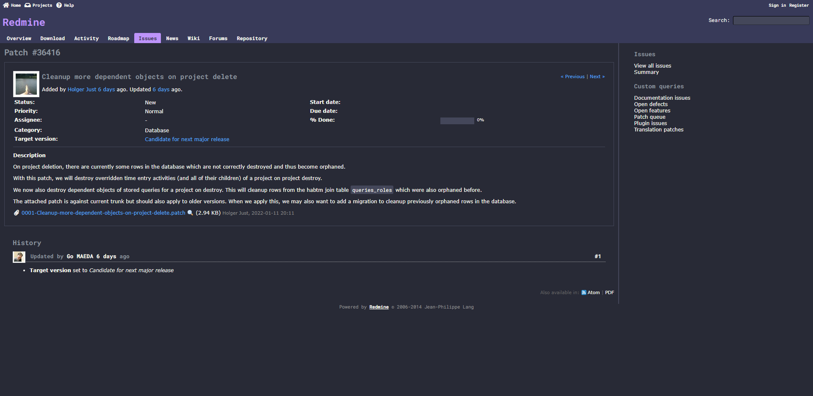

# Dracula for [Redmine](https://redmine.org)

> A dark theme for [Redmine](https://redmine.org).

## Install

All instructions can be found in [INSTALL.md](https://github.com/ocReaper/redmine-dracula/blob/master/INSTALL.md).

## Customization

- it can be used with or without purple header
- it can be used with a custom font, but defaults to "Roboto Mono"

## Team

This theme is maintained by the following person(s) and a bunch of [awesome contributors](https://github.com/ocReaper/redmine-dracula/graphs/contributors).

 |
--- |
[Ákos Resch](https://github.com/ocReaper) |

## License

[MIT License](./LICENSE)
